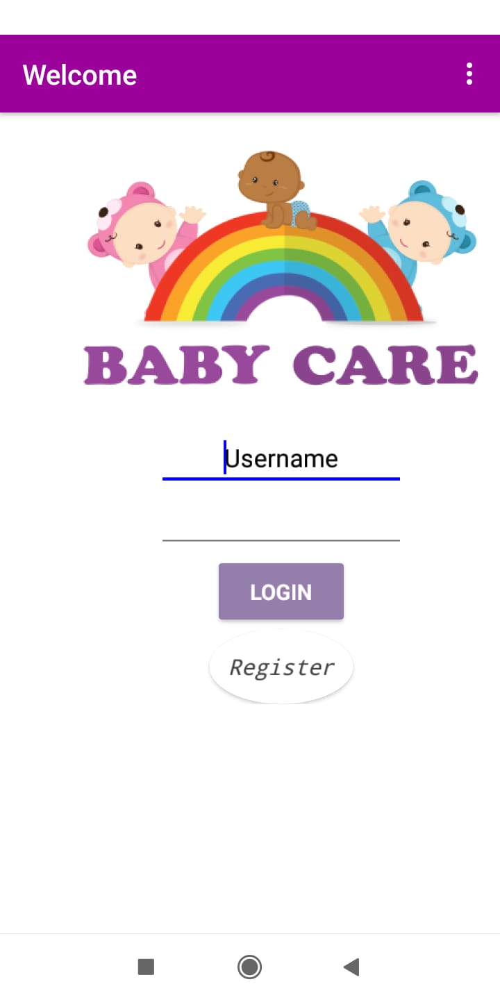
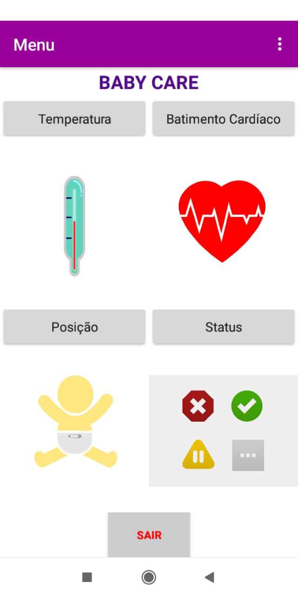
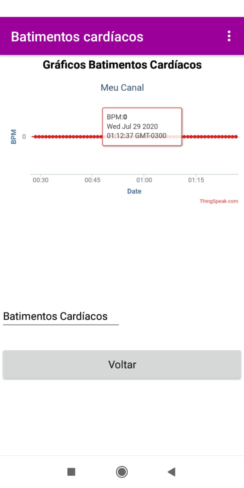
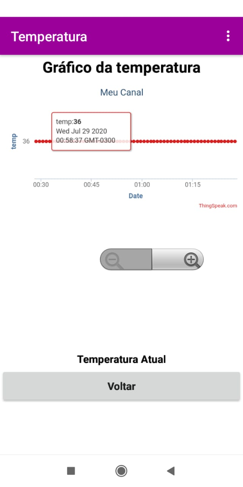

# BabyCare
## Sistema de monitoramento de bebês.

Dada a grande preocupação dos pais com o(s) filho(s), principalmente na fase inicial da vida do bebê (recém-nascido), o projeto consiste em um dispositivo vestível que irá realizar o monitoramento de algumas variáveis importantes do recém-nascido, como sua frequência cardíaca, temperatura corporal e posição.
O sistema avisará, por meio de uma aplicação móvel, quando houver alguma anomalia nas variáveis que são aferidas em um intervalo de tempo determinado. Além disso, o sistema deverá manter os dados das as leituras realizadas atualizados, e esses dados poderão ser consultados na aplicação mobile.

## Funcionalidades

Equipado com sensores para coletar informações do bebê, o dispositivo consegue captar batimentos cardíacos, temperatura e a posição em que o bebê se encontra, enviando esses dados para o dispositivo móvel e os apresentando de forma clara e fácil.

## Telas

### Tela de Login

### Tela Principal

### Telas de visualização individual 

,
,

### Tela de Status

